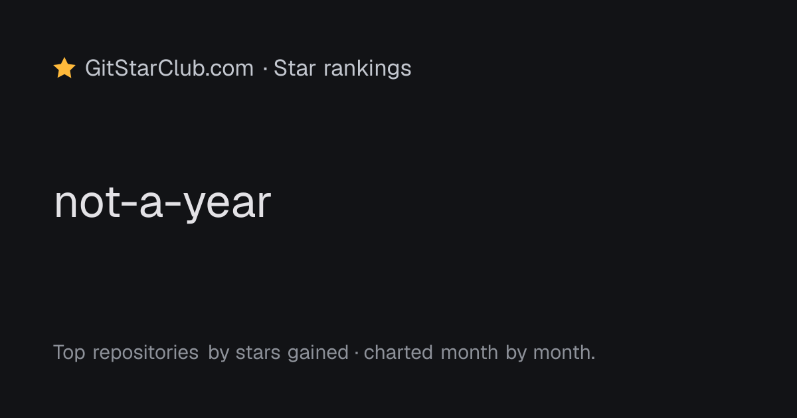
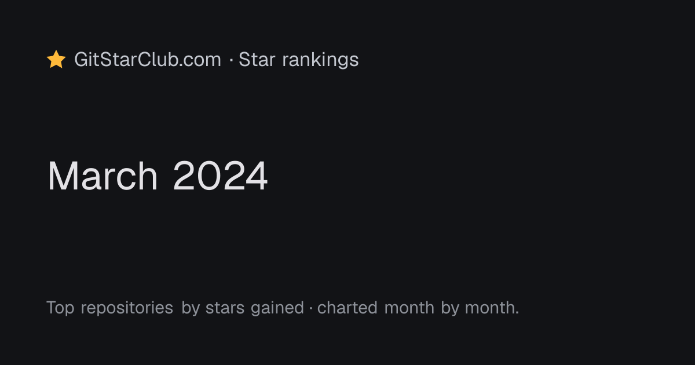

# Public path parameter boundaries

`web/lib/public-params.ts` owns the shared input contract for repository,
organization, and ranking pages, metadata, social images, and data readers.

Next.js decodes dynamic route segments before giving them to these handlers.
The application validates the decoded string and never calls `decodeURIComponent`
on it again. A literal or remaining encoded percent sign is invalid. Malformed
escapes rejected by Next.js do not need an application decode fallback.

| Input | Accepted decoded syntax |
|---|---|
| GitHub owner/login | 1-39 ASCII alphanumeric characters with single internal hyphens; case preserved |
| Repository name | 1-100 ASCII letters, digits, dots, underscores, and hyphens; single/double dot segments rejected |
| Repository ID | Positive safe integer, obtained from the published repository lookup |
| Ranking year | Four ASCII digits, from FIRST_YEAR (2015) through the next UTC year; the next year allows ISO weeks that start in December |
| Month route segment | One or two ASCII digits, 1-12; normalized to YYYY-MM for storage |
| ISO week route segment | W/w plus one or two ASCII digits, 1 through the year's actual last ISO week; normalized to YYYY-Www |
| Storage rank/heatmap period | Canonical year/month/week syntax for its window; rank window all accepts only all |

The repository character set and length follow [GitHub's repository creation
documentation](https://docs.github.com/en/repositories/creating-and-managing-repositories/creating-a-new-repository).
These checks validate syntax, not account existence. Repository routes still
resolve through the published lookup and alias map; organization routes require
an entity; ranking pages require available published data.

Invalid page/metadata input calls `notFound()` before input-derived data reads.
Repository images use the site card for invalid/unknown repositories. Ranking
images validate the year and period before reads, require both a rank and lookup,
and otherwise use the same site card. Titles come from normalized numeric
periods, and row names come from validated published lookup entries. Valid
historical ranking images retain their existing labels and top-three layout.

Entity, rank, and heatmap readers independently validate their arguments before
constructing storage paths, including live overlay paths. Public readers return
null on invalid input without storage I/O. Authoritative cron readers throw on
invalid input rather than interpreting it as a missing base view.

Tests in `web/lib/public-params.test.ts` exercise the real handlers and readers in
isolated child processes so module mocks cannot contaminate the full Bun suite.
All route decoding cases are local, use fabricated data, and perform no network
requests or production probes.

### Regression sensitivity

At 13f1626, `cd web && bun test lib/public-params.test.ts --isolate` passed
74 tests. In a disposable detached copy, restoring the ten existing production
files changed by this fix from baseline b9650f0, while keeping the new validator
and tests, produced 71 passes and three failures (exit 1). The failing tests were
the actual image routes, page/metadata handlers, and storage readers. Restoring
those files from HEAD returned the tree to a clean tracked state. The experiment
used env -i, Node 24.20.0/Bun 1.3.14, BLOB_BASE_URL=https://blob.example.com, and
SEO_LIVE_BASE empty; the child-process fetch trap prevented network requests.

## Ranking image captures

These 1200x630 PNGs are the actual local `ImageResponse` output, captured before
and after the fix with absent data mocked in both runs. No live store is used.
The invalid month 99 used to wrap to a misleading March label; both invalid
inputs now use the site card.

| Input | Before | After |
|---|---|---|
| Year not-a-year |  |  |
| Year 2024, month 99 |  |  |
